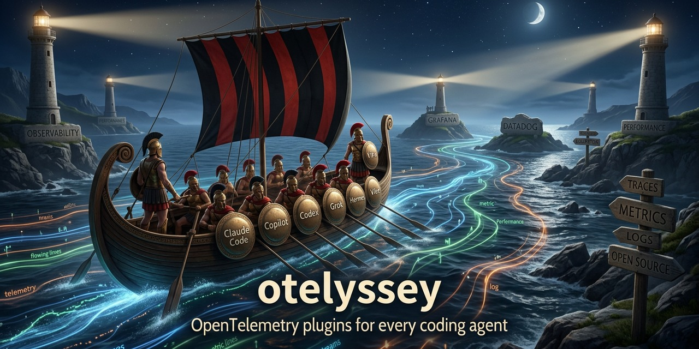

# otelyssey

A marketplace of OpenTelemetry agent plugins in the
[Agent Plugins](https://agent-plugins.org/) format, run by the repository
itself: submit a plugin once; the repository checks it, lists it and
follows its releases.

<p align="center">
  
</p>

## Install

Add the marketplace to your client:

```text
claude plugin marketplace add using-system/otelyssey
copilot plugin marketplace add using-system/otelyssey
codex plugin marketplace add using-system/otelyssey
grok plugin marketplace add using-system/otelyssey
apm marketplace add using-system/otelyssey
hermes plugins pack install https://raw.githubusercontent.com/using-system/otelyssey/main/hermes-pack.yaml
```

Then pick a plugin below: its page has the install line — and the ones for
VS Code, Kiro, OpenClaw and Mistral Vibe.

## Submit a plugin

**[Open a plugin submission](https://github.com/using-system/otelyssey/issues/new?template=submit-plugin.yml)**
— one form, the repository does the rest.

Your plugin needs:

- a public GitHub repository;
- a `plugin.json` in the [Agent Plugins](https://agent-plugins.org/) format,
  at the repository's root or in a subdirectory: the form asks for its URL,
  everything else is read from it;
- OpenTelemetry as its subject: instrumentation, semantic conventions, the
  Collector, or a backend that ingests its telemetry.

The repository answers on the issue. Once listed, it follows your releases
every night. Bugs, ideas, code: see [CONTRIBUTING](CONTRIBUTING.md).

## Plugins

<!-- otelyssey:plugins -->
### 🧭 Instrumentation

Put the telemetry in: SDKs, semantic conventions, instrumentation advice.

-  **[observability](marketplace/observability/README.md)** by [Basti Ortiz](https://bastidood.dev/) — Opinionated guidance for clear and operationally useful OpenTelemetry instrumentation.  
<a href="#"></a>&nbsp;&nbsp;<a href="#"></a>&nbsp;&nbsp;<a href="#"></a>&nbsp;&nbsp;<a href="#"></a>

-  **[opentelemetry-agent-skills](marketplace/opentelemetry-agent-skills/README.md)** by [OllyGarden](https://github.com/ollygarden) — Vendor-neutral OpenTelemetry skills for AI coding agents, grounded in upstream sources: SDK setup per language, the Collector and OCB, OTTL, declarative configuration, semantic conventions, upgrades and migrations. · also in Collector  
<a href="#"></a>&nbsp;&nbsp;<a href="#"></a>&nbsp;&nbsp;<a href="#"></a>&nbsp;&nbsp;<a href="#"></a>

-  **[stdtel](marketplace/stdtel/README.md)** by [amiable-dev](https://github.com/amiable-dev) — Telemetry for standards-as-skills: attributes token cost and policy outcomes to individual skills across Claude Code and GitHub Copilot. · also in Backends  
<a href="#"></a>&nbsp;&nbsp;<a href="#"></a>&nbsp;&nbsp;<a href="#"></a>&nbsp;&nbsp;<a href="#"></a>

### 🏛️ Backends

Talk to a backend: query it, its dashboards, alerts and issues.

-  **[arize-phoenix](marketplace/arize-phoenix/README.md)** by [Arize AI](https://arize.com) — Connect to your Phoenix instance to debug, evaluate, and improve LLM applications.  
<a href="#"></a>&nbsp;&nbsp;<a href="#"></a>&nbsp;&nbsp;<a href="#"></a>&nbsp;&nbsp;<a href="#"></a>

-  **[dynatrace-managed-mcp](marketplace/dynatrace-managed-mcp/README.md)** by [Dynatrace](https://www.dynatrace.com) — MCP server for Dynatrace Managed (self-hosted): query logs, metrics, events, entities, problems, security vulnerabilities and SLOs across one or more clusters.  
<a href="#"></a>&nbsp;&nbsp;<a href="#"></a>&nbsp;&nbsp;<a href="#"></a>&nbsp;&nbsp;<a href="#"></a>

-  **[langwatch](marketplace/langwatch/README.md)** by [LangWatch](https://langwatch.ai) — Records which repository and branch each coding-agent session worked in, and teaches the agent to read its own traces back from LangWatch.  
<a href="#"></a>&nbsp;&nbsp;<a href="#"></a>&nbsp;&nbsp;<a href="#"></a>&nbsp;&nbsp;<a href="#"></a>

-  **[pup](marketplace/pup/README.md)** by Datadog — Datadog API CLI with 49 command groups, 300+ subcommands. Skills and domain agents for monitoring, logs, APM, security, and infrastructure.  
<a href="#"></a>&nbsp;&nbsp;<a href="#"></a>&nbsp;&nbsp;<a href="#"></a>&nbsp;&nbsp;<a href="#"></a>

-  **[sentry](marketplace/sentry/README.md)** by [Sentry](https://sentry.io) — Set up Sentry, debug production issues, and configure application monitoring.  
<a href="#"></a>&nbsp;&nbsp;<a href="#"></a>&nbsp;&nbsp;<a href="#"></a>&nbsp;&nbsp;<a href="#"></a>

-  **[signoz](marketplace/signoz/README.md)** by [SigNoz](https://signoz.io) — Official SigNoz plugin for MCP setup, docs, queries, dashboards, and alerts  
<a href="#"></a>&nbsp;&nbsp;<a href="#"></a>&nbsp;&nbsp;<a href="#"></a>&nbsp;&nbsp;<a href="#"></a>

-  **[sumo-logic](marketplace/sumo-logic/README.md)** by [Sumo Logic](https://www.sumologic.com) — Query Sumo Logic logs, alerts, dashboards, and SIEM insights directly from Copilot. Connects to the Sumo Logic MCP server for natural language observability investigations.  
<a href="#"></a>&nbsp;&nbsp;<a href="#"></a>&nbsp;&nbsp;<a href="#"></a>&nbsp;&nbsp;<a href="#"></a>

### 🔭 Observability

Read it back: observe a run through its telemetry, wherever it lands.

-  **[oddyssey](marketplace/oddyssey/README.md)** by [using-system](https://github.com/using-system) — CLI toolbox for Observability-Driven Development (ODD): coding agents observe local runs on an OpenTelemetry/Grafana stack - or remote ones on any OpenTelemetry backend - and feed the next spec-driven improvement loop. · also in Instrumentation, Backends  
<a href="#"></a>&nbsp;&nbsp;<a href="#"></a>&nbsp;&nbsp;<a href="#"></a>&nbsp;&nbsp;<a href="#"></a>

<!-- /otelyssey:plugins -->
